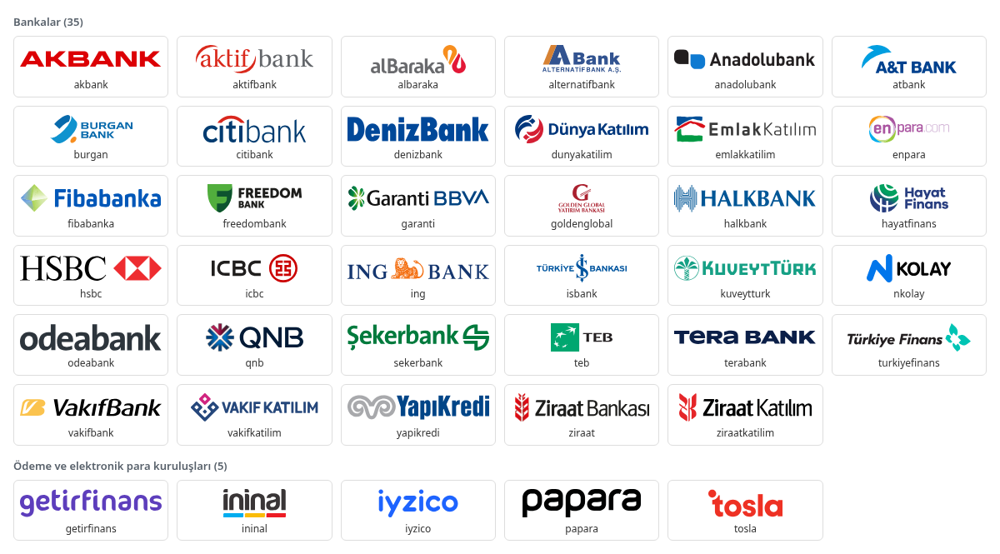

# Türkiye banka ve ödeme kuruluşu logoları — SVG

**Turkish bank & payment institution logos in SVG** · [English below](#english)

Türkiye'deki 35 banka ve 5 ödeme / elektronik para kuruluşunun **orijinal**
logoları, SVG biçiminde. Hiçbiri elle çizilmedi: her dosya aşağıda yazan
kaynaktan alındı, render edilip gözle doğrulandı ve web'de doğrudan
kullanılacak şekilde normalleştirildi. (Tek istisna Freedom Bank: raster bir
logodan otomatik vektörleştirildi — bkz. not.)

Logolar [Domainhizmetleri](https://www.domainhizmetleri.com)'nin kartla ödeme
ekranında, kartın hangi bankaya ait olduğunu göstermek için toplandı.



## Kullanım

Dosyaların kökünde `width`/`height` yok, yalnız içeriğe oturtulmuş bir `viewBox`
var. Bu yüzden `` ile kullanırken **yükseklik verin**, genişlik en/boy
oranından kendiliğinden çıkar:

```html

```

Yükseklik verilmezse bazı tarayıcılar içsel ölçüsü olmayan SVG'yi esnek kutuda
(`display:flex`) sıfıra indirir ve logo görünmez.

Depoyu indirmeden, jsDelivr üzerinden de kullanılabilir:

```html

```

**Canlı örnek sayfa:** [murattahtaci.github.io/turkish-bank-logos-svg/examples](https://murattahtaci.github.io/turkish-bank-logos-svg/examples/)
— üç kullanım biçimi yan yana ([`examples/index.html`](examples/index.html)).

### CSS sınıfı

[`bank-logos.css`](bank-logos.css) her logo için bir sınıf taşır; genişlik logonun
kendi oranından gelir, yükseklik varsayılan 24 px:

```html
<link rel="stylesheet" href="https://cdn.jsdelivr.net/gh/murattahtaci/turkish-bank-logos-svg@main/bank-logos.css">

<span class="bank-logo bank-logo--garanti" role="img" aria-label="Garanti BBVA"></span>
```

Boyutu değiştirmek için: `.bank-logo { height: 32px; }`

### JS — banka adından logo

Ödeme sağlayıcıları banka adını serbest metin döndürür (`T. GARANTİ BANKASI A.Ş.`,
`YAPI VE KREDİ BANKASI A.Ş.`…). [`index.js`](index.js) bu adı logoya çevirir;
eşleşme yoksa `null` döner — o durumda logonun yerine adı yazın.

```js
import { findBankSlug, bankLogoUrl } from 'https://cdn.jsdelivr.net/gh/murattahtaci/turkish-bank-logos-svg@main/index.js';

findBankSlug('T. GARANTİ BANKASI A.Ş.');   // 'garanti'
findBankSlug('ZİRAAT KATILIM BANKASI A.Ş.'); // 'ziraatkatilim' (Ziraat Bankası değil)
bankLogoUrl('T. GARANTİ BANKASI A.Ş.');    // '…/svg/garanti.svg'
findBankSlug('BİLİNMEYEN BANKA A.Ş.');                     // null
```

Eşleştirici katılım bankalarını ana bankadan (Ziraat Katılım / Ziraat, Vakıf
Katılım / VakıfBank) ve başka adların içinde geçen kısa adları (`teb`, `abank`)
ayırır. Sınama 52 durumla yapılıyor: 49 gerçek ad biçimi ve eşleşmemesi gereken
3 durum ([`test/`](test/index.test.mjs)).

npm ile: `npm install github:murattahtaci/turkish-bank-logos-svg`

### Liste

Kurum adları, tür (`bank` / `payment`), dosya yolları, boyutlar (`viewBox`),
kaynak ve lisans makine tarafından okunabilir biçimde [`logos.json`](logos.json) içinde.

## Normalleştirme

- `viewBox` içeriğin gerçek sınırlarına oturtuldu (marka kitlerindeki büyük boş
  tuvaller kırpıldı).
- Kök `width`/`height` kaldırıldı; yorum ve editör metadata'sı temizlendi.
- EPS/AI/PDF kaynaklar Ghostscript + `pdftocairo` ile SVG'ye çevrildi. Her
  çevirim, kaynak paketindeki PNG ile karşılaştırılarak doğrulandı.
- Dosyalarda script, olay özniteliği ya da dış bağlantı yok.

## Dosyalar ve kaynaklar

### Bankalar (35)

| Dosya | Kurum | Kaynak | Lisans |
|---|---|---|---|
| `akbank.svg` | Akbank | Wikimedia Commons · *Akbank logo 2025.svg* | Kamu malı |
| `aktifbank.svg` | Aktif Bank | kurumun web sitesi | Kurumun marka varlığı |
| `albaraka.svg` | Albaraka Türk | kurumun web sitesi | Kurumun marka varlığı |
| `alternatifbank.svg` | Alternatif Bank | worldvectorlogo | Kurumun marka varlığı |
| `anadolubank.svg` | Anadolubank | Wikimedia Commons · *Anadolubank logo.svg* | Kamu malı |
| `atbank.svg` | Arap Türk Bankası (A&T Bank) | Wikimedia Commons · *ATBANK logo.svg* | **CC BY-SA 4.0** — yazar: ATBANK |
| `burgan.svg` | Burgan Bank | Wikimedia Commons · *Burgan Bank logo.svg* | Kamu malı |
| `citibank.svg` | Citibank | Wikimedia Commons · *Citibank.svg* | Kamu malı |
| `denizbank.svg` | DenizBank | Wikimedia Commons · *DenizBank logo 2026.svg* | Kamu malı |
| `dunyakatilim.svg` | Dünya Katılım | Wikimedia Commons · *Dünya Katılım Logo.svg* | Kamu malı |
| `emlakkatilim.svg` | Türkiye Emlak Katılım | Wikimedia Commons · *Emlak Katılım logo.svg* | Kamu malı |
| `enpara.svg` | Enpara | Wikimedia Commons · *Enpara.com Logo.svg* | Kamu malı |
| `fibabanka.svg` | Fibabanka | kurumun marka kiti (PDF) | Kurumun marka varlığı |
| `freedombank.svg` | Freedom Bank (eski Turkish Bank) | raster logodan otomatik vektörleştirme (VTracer) — *bkz. not* | Kurumun marka varlığı |
| `garanti.svg` | Garanti BBVA | Wikimedia Commons · *Garanti BBVA 2019.svg* — *bkz. not* | Kamu malı |
| `goldenglobal.svg` | Golden Global Yatırım Bankası | kurumun web sitesi | Kurumun marka varlığı |
| `halkbank.svg` | Halkbank | Wikimedia Commons · *Halkbank logo.svg* | Kamu malı |
| `hayatfinans.svg` | Hayat Finans Katılım | kurumun web sitesi | Kurumun marka varlığı |
| `hsbc.svg` | HSBC | Wikimedia Commons · *Hsbc-logo.svg* | Kamu malı |
| `icbc.svg` | ICBC Turkey | Wikimedia Commons · *ICBC China logo.svg* | Kamu malı |
| `ing.svg` | ING Bank | seeklogo (AI → SVG) | Kurumun marka varlığı |
| `isbank.svg` | Türkiye İş Bankası | Wikimedia Commons · *Türkiye İş Bankası logo.svg* | Kamu malı |
| `kuveytturk.svg` | Kuveyt Türk | Wikimedia Commons · *Kuveyt Türk Logo.svg* | Kamu malı |
| `nkolay.svg` | N Kolay (Aktif Bank) | kurumun web sitesi | Kurumun marka varlığı |
| `odeabank.svg` | Odeabank | kurumun web sitesi | Kurumun marka varlığı |
| `qnb.svg` | QNB | Wikimedia Commons · *QNB Logo.svg* | Kamu malı |
| `sekerbank.svg` | Şekerbank | Wikimedia Commons · *Şekerbank logo.svg* | Kamu malı |
| `teb.svg` | TEB | seeklogo (EPS → SVG) | Kurumun marka varlığı |
| `terabank.svg` | Tera Bank (Tera Yatırım Bankası) | kurumun web sitesi | Kurumun marka varlığı |
| `turkiyefinans.svg` | Türkiye Finans Katılım | kurumun basın odası (AI) | Kurumun marka varlığı |
| `vakifbank.svg` | VakıfBank | Wikimedia Commons · *Vakıfbank logo.svg* | Kamu malı |
| `vakifkatilim.svg` | Vakıf Katılım | Wikimedia Commons · *Vakıf Katılım Logo.svg* | Kamu malı |
| `yapikredi.svg` | Yapı Kredi | kurumun web sitesi | Kurumun marka varlığı |
| `ziraat.svg` | Ziraat Bankası | Wikimedia Commons · *Ziraat Bankası logo.svg* | Kamu malı |
| `ziraatkatilim.svg` | Ziraat Katılım | Wikimedia Commons · *Ziraat Katılım Bankası Logo.svg* | Kamu malı |

### Ödeme ve elektronik para kuruluşları (5)

| Dosya | Kurum | Kaynak | Lisans |
|---|---|---|---|
| `getirfinans.svg` | Getir Finans (e-para) | kurumun web sitesi (satır içi SVG) | Kurumun marka varlığı |
| `ininal.svg` | ininal (e-para) | seeklogo (EPS → SVG) | Kurumun marka varlığı |
| `iyzico.svg` | iyzico (ödeme ve e-para) | kurumun marka dosyası ("Beyaz Zeminde Kullanım") | Kurumun marka varlığı |
| `papara.svg` | Papara (e-para) | seeklogo | Kurumun marka varlığı |
| `tosla.svg` | Tosla (e-para) | kurumun web sitesi | Kurumun marka varlığı |

Commons lisansları Commons API'sinden okundu (2026-09-15). "Kamu malı" olanların
çoğu Commons'ta ayrıca **tescilli marka** olarak işaretli.

### Notlar

- **Freedom Bank:** dosya raster bir logodan otomatik vektörleştirildi (VTracer);
  markanın asıl vektör dosyası değil. Beyaz zemin için "FREEDOM BANK" kilidi,
  renkler olduğu gibi. Kurumun kendi vektör dosyası bulunursa değiştirilir.
- **Garanti BBVA:** yoncanın renk geçişi kaynakta vektör değil, yonca şekliyle
  kırpılmış gömülü bir JPEG (dosyanın ~19 KB'ı). Olduğu gibi bırakıldı.
- **A&T Bank:** CC BY-SA 4.0 lisanslı; kullanırken atıf verin ve türev işi aynı
  lisansla paylaşın.
- **iyzico:** kendi kartını da çıkarıyor (iyzico Kart, ön ödemeli Mastercard,
  BIN `535805`). iyzico'nun BIN sorgusu bu kart için kurum adı olarak `iyzico`
  (`bankCode` 864) döndürüyor, BIN veri tabanları ise yasal adı ("İyzi Ödeme ve
  Elektronik Para Hizmetleri A.Ş."); eşleştirici ikisini de `iyzico`'ya çevirir.
  Kaynak: [iyzico dökümanı](https://docs.iyzico.com/odeme-metotlari/api/non-3ds/non-3ds-entegrasyonu).

## Katkı

Listede olmayan bir banka ya da ödeme kuruluşunun SVG logosunu (kurumun kendi
sitesinden ya da marka kitinden) bulursanız pull request açabilirsiniz —
kaynağını tabloya ekleyerek.

Yeni bir logo eklerken: dosya `svg/` altına, kaydı (türüyle: `bank` ya da
`payment`) `logos.json`'a, satırı ilgili tabloya; kurum adının eşleşmesi
gerekiyorsa `index.js` içindeki `MATCH`'e. Sonra:

```bash
npm run build   # logos.json boyutları, logos.js ve bank-logos.css yeniden üretilir
npm test        # dosya · liste · README · CSS tutarlılığı ve ad eşleştirme
```

## Marka uyarısı

Bu logolar sahiplerinin **tescilli markalarıdır**. Bu depo yalnız dosyaları bir
araya getirir ve web'de kullanıma hazırlar; hiçbir marka üzerinde kullanım hakkı
vermez ve kurumlarla bir bağlantı ya da onay ilişkisi ima etmez. Logoları, ilgili
kurumu doğru biçimde tanıtmak (ör. kartın hangi bankaya ait olduğunu göstermek)
dışındaki amaçlarla kullanmadan önce kurumun marka kullanım kurallarına bakın.

Depo ayrıca bir lisans vermez; her dosyanın lisansı yukarıdaki tabloda yazılıdır.

---

## English

Original SVG logos of **35 banks and 5 payment / e-money institutions in Turkey**, collected
for the card payment screen of [Domainhizmetleri](https://www.domainhizmetleri.com)
to show which bank a card belongs to.

- **Not redrawn.** Each file comes from the source in the table above (Wikimedia
  Commons, the institution's own website or brand kit, seeklogo, worldvectorlogo),
  was rendered and checked by eye, and normalized for the web. One exception:
  Freedom Bank was auto-traced from a raster logo.
- **Tight `viewBox`, no root `width`/`height`.** Set a height when you use it:
  ``
- **CDN:** `https://cdn.jsdelivr.net/gh/murattahtaci/turkish-bank-logos-svg@main/svg/<file>.svg`
- **CSS classes:** [`bank-logos.css`](bank-logos.css) —
  `<span class="bank-logo bank-logo--garanti" role="img" aria-label="Garanti BBVA"></span>`
- **JS:** [`index.js`](index.js) maps the free-text bank names returned by payment
  providers to a logo: `findBankSlug('T. GARANTİ BANKASI A.Ş.')` → `'garanti'`,
  `bankLogoUrl(name)` → URL, `null` when there is no match.
  `npm install github:murattahtaci/turkish-bank-logos-svg`
- **Live examples:** [murattahtaci.github.io/turkish-bank-logos-svg/examples](https://murattahtaci.github.io/turkish-bank-logos-svg/examples/)
- **Machine-readable list:** [`logos.json`](logos.json)
- **Licenses per file:** 20 public domain (Wikimedia Commons), 1 CC BY-SA 4.0
  (A&T Bank — attribute and share alike), 19 trademark assets of the institution.
- **Contributions:** a bank or payment institution missing? Pull requests welcome.

**Trademark notice:** these logos are registered trademarks of their owners.
This repository only collects and prepares the files; it grants no rights to any
trademark and implies no affiliation with or endorsement by the institutions.
